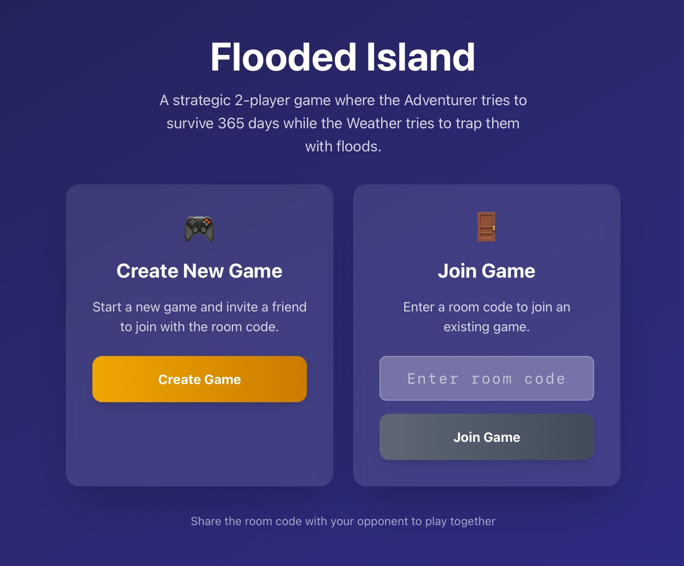
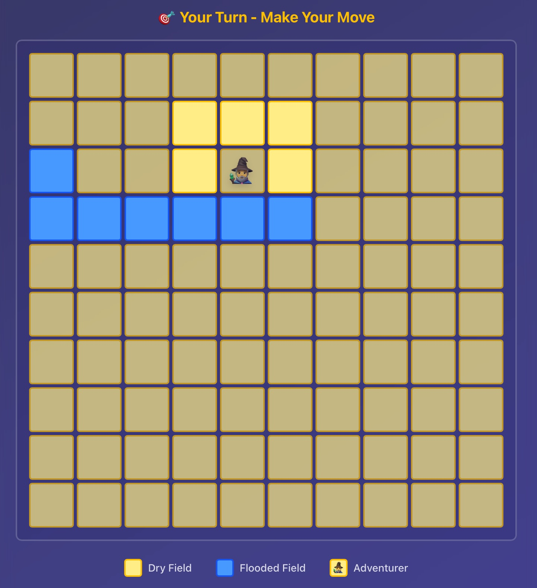

# Flooded Island

A turn-based multiplayer strategy game where two players compete on a flooding grid. One player (the Adventurer) tries to survive 365 days by moving strategically and drying adjacent fields, while the other player (the Weather) attempts to trap them by flooding the island.

This is a pet project exploring AI-assisted spec-driven development (SDD), modern frontend practices, and Python backend development.

**Ready to play?** Try at https://island.olegmagn.es!

<p align="center">
  
  
  
</p>

## 🎮 Game Overview

- **Two Asymmetric Roles**: Adventurer (survivor) vs Weather (adversary)
- **Turn-Based Strategy**: Each player makes strategic decisions to win
- **Online Multiplayer**: Real-time WebSocket communication
- **Configurable Experience**:
    - **Grid Size**: Adjustable from 3x3 to 10x10 with visual preview and quick selection (5x5, 7x7, 10x10).
    - **Difficulty**: Configurable Max Flood Count (1-3 fields per turn).
- **UI**: Indigo-themed interface with glass morphism design and smooth animations

## 🚀 Development

### Prerequisites

- **Python 3.12+** (backend)
- **Node.js 18+** (frontend)
- **[uv](https://github.com/astral-sh/uv)** - Fast Python package installer (Required)

### Installation & Setup

1. **Clone the repository**
```bash
git clone https://github.com/ttaggg/flooded_island.git
cd flooded_island
```

2. **Start the development stack**

Configure `.env.dev` in the project root (copy from `.env.dev.example` if available, or create one).

Then run the deployment script:

```bash
chmod +x scripts/deploy_dev.sh scripts/stop_dev.sh
./scripts/deploy_dev.sh
```

This script automatically:
- Sets up the Python environment using `uv`
- Installs frontend dependencies (`npm install`)
- Starts the backend server on http://localhost:8000
- Starts the frontend dev server on http://localhost:5173

3. **Stop the stack**
```bash
./scripts/stop_dev.sh
```

## 📁 Project Structure

```
flooded_island/
├── backend/             # FastAPI backend
│   ├── game/            # Game logic modules
│   ├── models/          # Pydantic data models
│   ├── routers/         # API routes and WebSocket handlers
│   ├── main.py          # Application entry point
│   └── pyproject.toml   # Python dependencies (managed by uv)
├── frontend/            # React + TypeScript frontend
│   ├── src/
│   │   ├── components/  # React components
│   │   ├── hooks/       # Custom hooks
│   │   ├── types/       # TypeScript types
│   │   └── utils/       # Utility functions
│   └── package.json     # Node dependencies
├── docs/                # Project documentation
├── deploy/              # Deployment configurations (Nginx, Systemd)
└── scripts/             # Automation scripts (dev/prod)
```

## 🎯 How to Play

1.  **Create Room**: One player creates a room.
2.  **Configure Game**: The creator configures the board size (3-10) and max flood count (1-3).
3.  **Select Roles**: Players choose Adventurer or Weather roles.
4.  **Play**:
    *   **Adventurer's Turn**: Move to an adjacent dry field. Automatically dries 4 surrounding fields (N/S/E/W).
    *   **Weather's Turn**: Flood 0 to *Max Flood Count* dry fields.
5.  **Win Conditions**:
    *   **Adventurer wins**: Survive 365 days (turns).
    *   **Weather wins**: Trap the adventurer (no valid moves).

## 🛠️ Tech Stack

### Backend
- **FastAPI**: Modern Python web framework
- **Uvicorn**: ASGI server
- **WebSockets**: Real-time communication
- **uv**: Fast Python package and project manager
- **Ruff**: Extremely fast Python linter and formatter

### Frontend
- **React 18**: UI library
- **TypeScript**: Type safety
- **Vite 7**: Next generation frontend tooling
- **Tailwind CSS 4**: Utility-first CSS framework

## 🚢 Deployment

The project includes scripts for easy production deployment on Linux servers (e.g., Ubuntu).

1.  **Prerequisites on server**:
    ```bash
    sudo apt update && sudo apt install nginx certbot python3-certbot-nginx python3 python3-venv nodejs npm -y
    ```

2.  **Deploy**:
    Copy the project to your server, create `.env.prod`, and run:
    ```bash
    sudo ./scripts/deploy_prod.sh
    ```

    This will:
    - Build the frontend
    - Set up the backend environment
    - Configure Nginx and Systemd services
    - Serve the frontend static files via the backend/Nginx setup

3.  **SSL**:
    ```bash
    sudo certbot --nginx -d your-domain.com
    ```

## 📚 Documentation

- [Game Rules](docs/game_rules.md) - Detailed game mechanics
- [Technical Specification](docs/technical_spec.md) - System architecture
- [UI Design](docs/ui_design.md) - Interface design decisions
- [Implementation Plan](docs/implementation_plan.md) - Development roadmap
- [Deployment Guide](deploy/README.md) - Production deployment instructions
